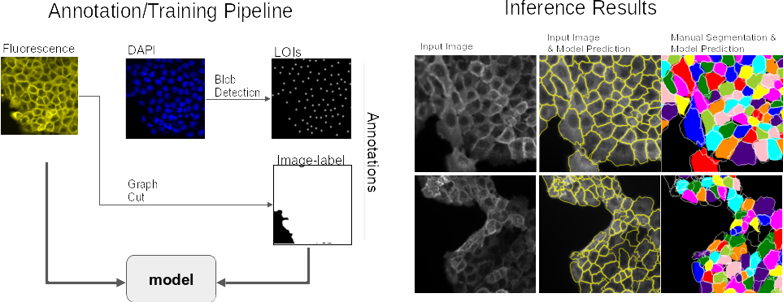
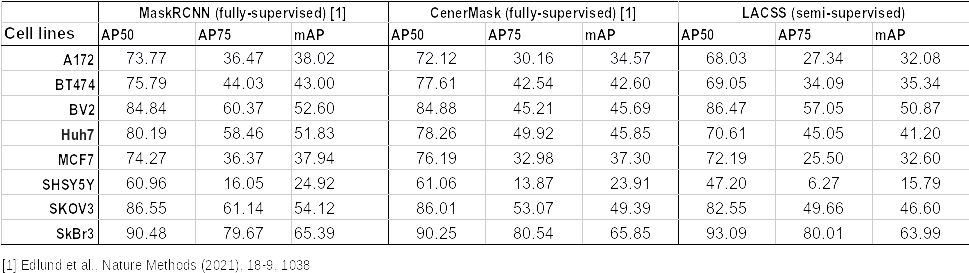

# LACSS (Location assisted cell segmentation system)

_LACSS is a deep-learning model for single-cell segmentation built on weakly-supervised end-to-end learning._

Ref: https://www.nature.com/articles/s42003-023-04608-5

It is designed to utilize two types of weak annotations: (a) image-level segmentation, and (b) location-of-interests (LOIs). These annotatins are chosen because they can often be produced progammably using simple unsupervised algorithms from experimental data. Our goal is to build a streamlined annotation-training pipeline that requires no manual input from humans. Here's an example:

 

 

LACSS models are usually accurate enough to compete with fully-supervised models. Here are some benchmarks on the LIVECell dataset.

 

#### Model checkpoints
Model checkpoints can be found [here](https://drive.google.com/drive/folders/1OWdll3vRcwWhuZgNoom1-BHSg0rpvZrc?usp=sharing).

#### Usage
You can try the demo notebook in colab:

