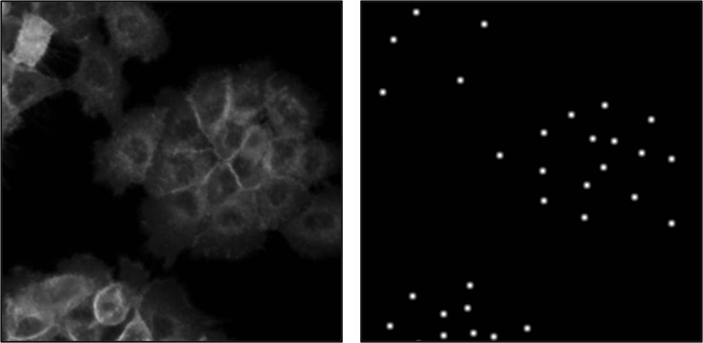
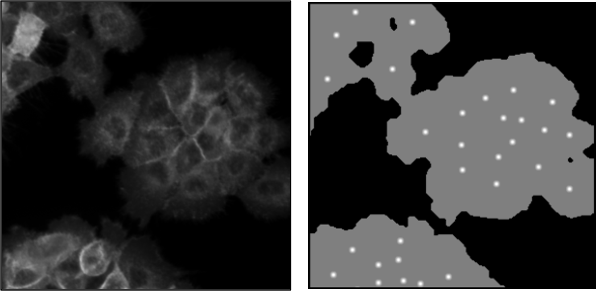
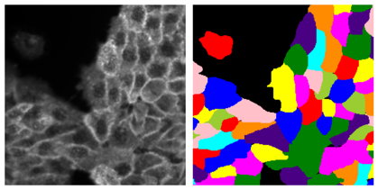
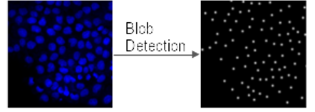

## LACSS

_LACSS is a deep-learning model for single-cell segmentation from microscopy images._ 

Ref: https://www.nature.com/articles/s42003-023-04608-5

### Why LACSS?
LACSS is designed to utilize point labels for model training. You have three options:

| Method | Data(left) / Label(right)|
| --- | --- |
| Point |  |
| Point + Mask |  |
| Segmentation |  |

You can of course also combined these labels in any way you want.

### What is included?

- A library for training LACSS model and performing inference
- A few pretrained models as transfer learning starting point
- SMC-based cell tracking utility for people interested in cell tracking

### How to generate point label?

If your data include nuclei counter-stain, the easist way to generate point label for your image is to use a [blob detection](https://scikit-image.org/docs/stable/auto_examples/features_detection/plot_blob.html) algorithm on the nuclei images:

